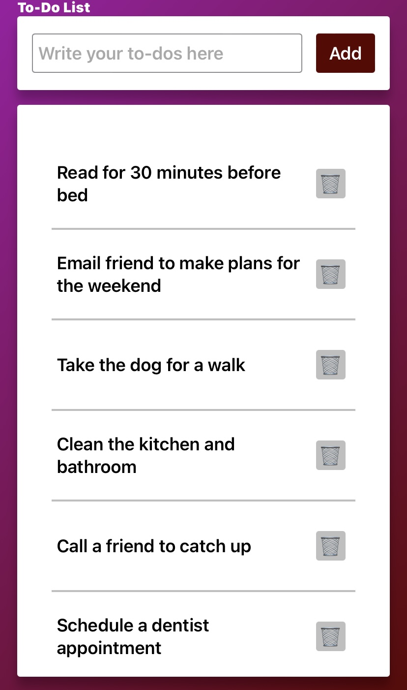

# To-Do List

This is a simple web application that allows users to create a to-do list. Users can add new tasks, mark them as completed, and delete them.

## Technologies Used

This project was built using HTML, CSS, and JavaScript. 

## How to Use

1. Clone the repository or download the code files.
2. Open the `index.html` file in a web browser.
3. To add a new task, type it in the input field and click the "Add" button.
4. To mark a task as completed, click on the task text.
5. To delete a task, click the trash can icon next to the task.

## Features

- Add new tasks
- Mark tasks as completed
- Delete tasks

## Preview
```link
https://laythalqadhi.github.io/to-do-list/
```

